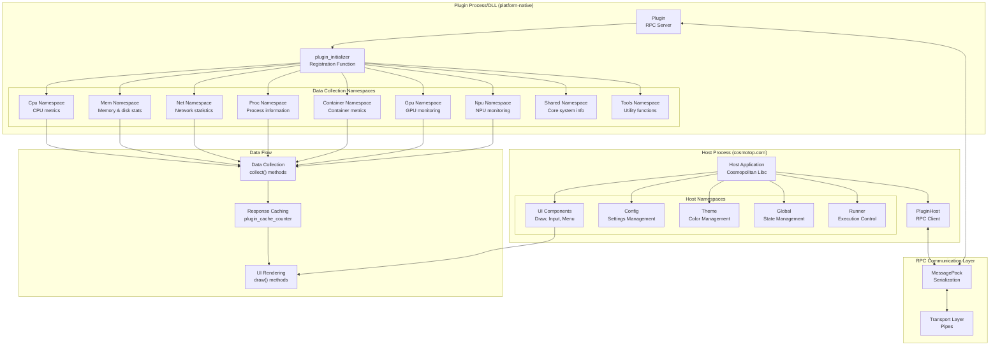
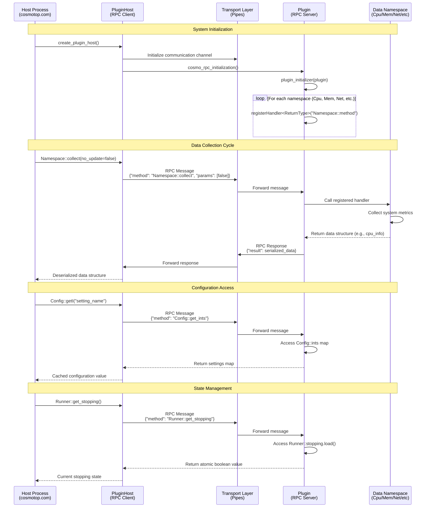

# Cosmotop Architecture

This document describes the architecture and data flow of the Cosmotop system monitoring application, focusing on the plugin RPC framework and namespace organization.

## System Architecture Overview

## Plugin RPC Communication Flow

## Data Type Namespaces and Their Structures

```mermaid
classDiagram
    class CpuNamespace {
        +cpu_info collect(bool no_update)
        +string get_cpuHz()
        +bool get_has_battery()
        +vector~string~ get_available_fields()
        +tuple~int,float,long,string~ get_current_bat()
    }
    
    class MemNamespace {
        +mem_info collect(bool no_update)
        +uint64_t get_totalMem()
        +bool get_has_swap()
        +int get_disk_ios()
    }
    
    class NetNamespace {
        +net_info collect(bool no_update)
        +string get_selected_iface()
        +void set_selected_iface(string iface)
        +vector~string~ get_interfaces()
        +unordered_map~string,uint64_t~ get_graph_max()
    }
    
    class ProcNamespace {
        +vector~proc_info~ collect(bool no_update)
        +int get_numpids()
        +void set_collapse(int val)
        +void set_expand(int val)
        +detail_container get_detailed()
    }
    
    class GpuNamespace {
        +vector~gpu_info~ collect(bool no_update)
        +int get_count()
        +vector~string~ get_gpu_names()
        +unordered_map~string,deque~long long~~ get_shared_gpu_percent()
    }
    
    class NpuNamespace {
        +vector~npu_info~ collect(bool no_update)
        +int get_count()
        +vector~string~ get_npu_names()
        +unordered_map~string,deque~long long~~ get_shared_npu_percent()
    }
    
    class ContainerNamespace {
        +vector~container_info~ collect(bool no_update)
        +int get_numcontainers()
        +bool get_has_containers()
    }
    
    class SharedNamespace {
        +void init()
        +long get_coreCount()
        +bool shutdown()
    }
    
    class ConfigNamespace {
        +unordered_map~string,int~ get_ints()
        +unordered_map~string,bool~ get_bools()
        +unordered_map~string,string~ get_strings()
        +void ints_set_at(string name, int value)
    }
    
    class cpu_info {
        +unordered_map~string,deque~long long~~ cpu_percent
        +vector~deque~long long~~ core_percent
        +vector~deque~long long~~ temp
        +long long temp_max
        +array~double,3~ load_avg
    }
    
    class mem_info {
        +unordered_map~string,uint64_t~ stats
        +unordered_map~string,deque~long long~~ percent
        +unordered_map~string,disk_info~ disks
        +vector~string~ disks_order
    }
    
    class net_info {
        +unordered_map~string,deque~long long~~ bandwidth
        +unordered_map~string,net_stat~ stat
        +string ipv4
        +string ipv6
        +bool connected
    }
    
    class proc_info {
        +size_t pid
        +string name, cmd, short_cmd
        +size_t threads
        +string user
        +uint64_t mem
        +double cpu_p, cpu_c
        +char state
        +uint64_t ppid
        +bool collapsed, filtered
    }
    
    class gpu_info {
        +unordered_map~string,deque~long long~~ gpu_percent
        +unsigned int gpu_clock_speed
        +long long pwr_usage, pwr_max_usage
        +deque~long long~ temp
        +long long mem_total, mem_used
        +long long pcie_tx, pcie_rx
    }
    
    class container_info {
        +string container_id, name, image
        +string command, state
        +uint64_t created, mem_usage, mem_limit
        +double cpu_percent
        +uint64_t net_rx, net_tx
        +uint64_t block_read, block_write
    }
    
    CpuNamespace --> cpu_info
    MemNamespace --> mem_info
    NetNamespace --> net_info
    ProcNamespace --> proc_info
    GpuNamespace --> gpu_info
    ContainerNamespace --> container_info
```

## Key Architectural Features

### Dual-Binary Architecture
- **Host executable** (`cosmotop.com`): Multiplatform binary using Cosmopolitan Libc for UI rendering and management
- **Platform plugins**: Native executables/DLLs for OS-specific system data collection

### RPC Framework
- Uses **MessagePack** serialization for efficient binary communication
- **Template-based handler registration** with type safety
- **Bidirectional communication** between host and plugin processes
- **Response caching** mechanism using `plugin_cache_counter`

### Data Collection Pattern
Each namespace follows a consistent pattern:
1. **collect()** method: Primary data gathering function
2. **Getter methods**: Access cached or computed values
3. **Setter methods**: Modify configuration or state
4. **Data structures**: Type-safe containers for system metrics

### Plugin Communication Lifecycle
1. **Initialization**: Plugin registers all RPC handlers for each namespace
2. **Data Collection**: Host calls collect() methods via RPC
3. **Caching**: Responses are cached to avoid redundant calls
4. **Configuration Access**: Host retrieves settings through Config namespace
5. **State Management**: Host monitors execution state via Runner/Global namespaces

This architecture enables cosmotop to maintain a single multiplatform executable while leveraging platform-specific system APIs through native plugins, providing comprehensive system monitoring across different operating systems.